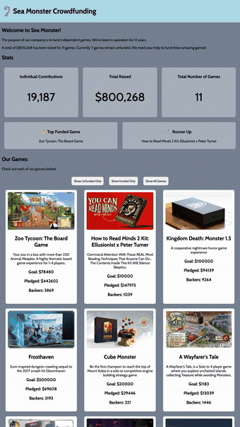

# WEB102 Prework - *Sea Monster Crowdfunding*

Submitted by: **Daniel Aguilar**

  **Sea Monster Crowdfunding** is an interactive web dashboard created for the CodePath WEB102 prework. It displays crowdfunding data for a
  collection of games, summarizes contributions and funding totals, highlights the most-funded games, and lets users filter projects by funding
  status.

  This project practices HTML, CSS Flexbox, and JavaScript concepts including DOM manipulation, loops, template literals, event listeners, and
  array methods such as `filter()`, `reduce()`, and `sort()`.

// Time spent: **4** hours spent in total

## Required Features

The following **required** functionality is completed:

* [✅] The introduction section explains the background of the company and how many games remain unfunded.
* [✅] The Stats section includes information about the total contributions and dollars raised as well as the top two most funded games.
* [✅] The Our Games section initially displays all games funded by Sea Monster Crowdfunding
* [✅] The Our Games section has three buttons that allow the user to display only unfunded games, only funded games, or all games.

The following **optional** features are implemented:

* [ ] List anything else that you can get done to improve the app functionality!

## Video Walkthrough

Here's a walkthrough of implemented features:

GIF created with OBS Studio and ffmpeg.

**Full walkthrough with narration:** https://web102-prework-walkthrough.vercel.app

## AI disclosure

I solved Challenges 2 through 7 myself with no coding agent. `index.html` and the `games.js` data came from the CodePath starter repository; the work added to `index.js` and `style.css` is mine. I used AI only to produce the walkthrough video and the README GIF — an agent ran the OBS Studio capture and the ffmpeg edit, and the narration is an AI voice clone of my own voice reading a script the agent wrote. The code is mine. The video production is not.

To see part of my thought process, view commits [a8ace18](https://github.com/Daguilar0123/web102_prework/commit/a8ace18) and [9d4bcc8](https://github.com/Daguilar0123/web102_prework/commit/9d4bcc8). I had commented out code from past attempts that failed. I also used `console.log("...")` debugging statements.

## Notes

The toughest part was implementing the ternary operator. It required reading the suggested supplemental material but I have no complaints. I was challenging but not too challenging for this level.

## License

    Copyright [2026] [Daniel Ismael Aguilar]

    Licensed under the Apache License, Version 2.0 (the "License");
    you may not use this file except in compliance with the License.
    You may obtain a copy of the License at

        http://www.apache.org/licenses/LICENSE-2.0

    Unless required by applicable law or agreed to in writing, software
    distributed under the License is distributed on an "AS IS" BASIS,
    WITHOUT WARRANTIES OR CONDITIONS OF ANY KIND, either express or implied.
    See the License for the specific language governing permissions and
    limitations under the License.

